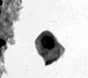
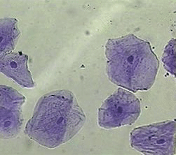

pylsm
=====

An implementation of the segmentation algorithm as described in:

A new level set model for cell image segmentation  
Ma Jing-Feng (马竟锋)1, Hou Kai (侯 凯)3, Bao Shang-Lian (包尚联)2,3 and Chen Chun (陈 纯)1  
2011 Chinese Physical Society and IOP Publishing Ltd   
Chinese Physics B, Volume 20, Number 2  

http://iopscience.iop.org/article/10.1088/1674-1056/20/2/028701/pdf

